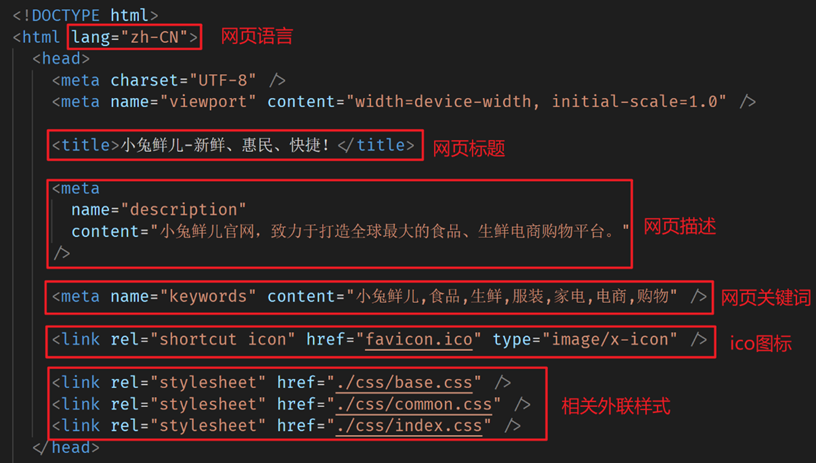
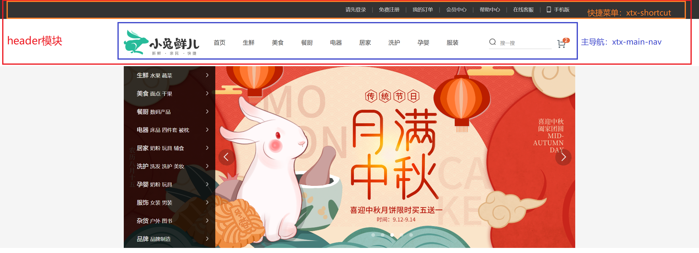
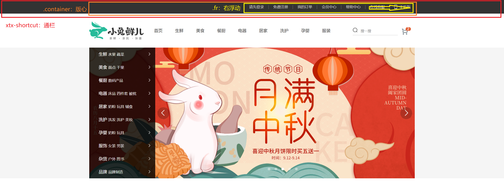
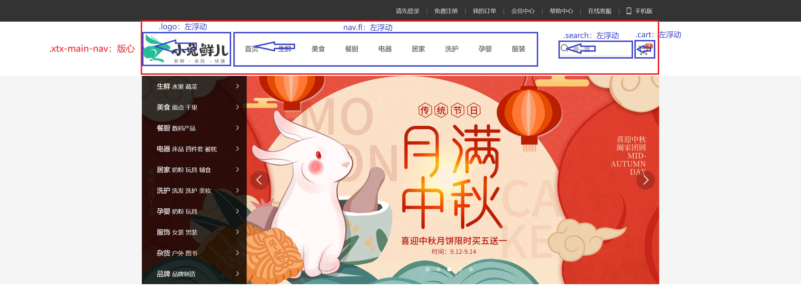
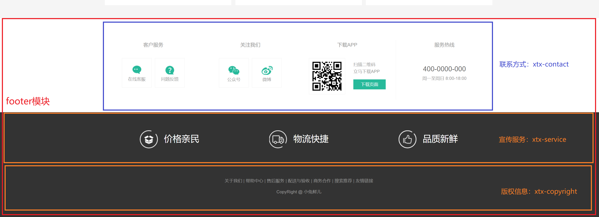
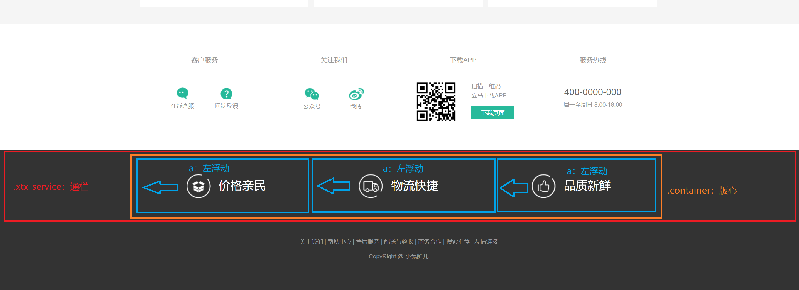
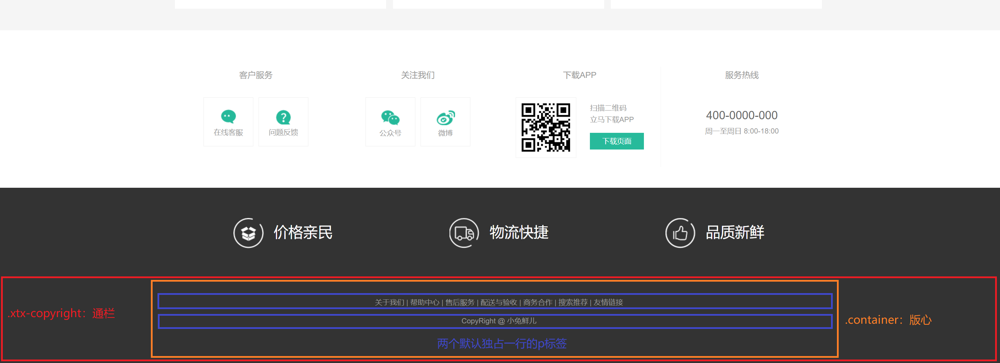
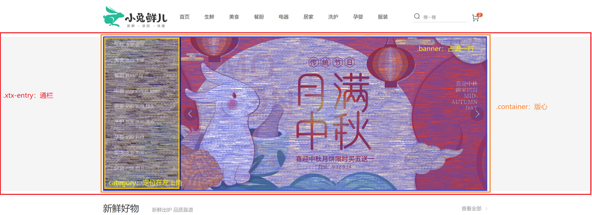
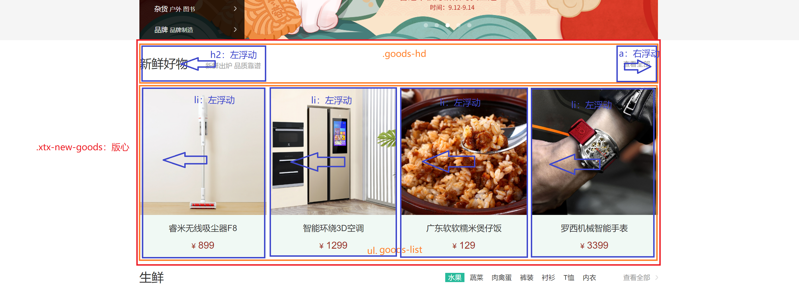
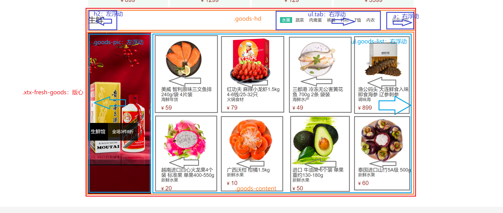

# 小兔鲜项目布局过程笔记

## 能力目标

> - [ ] 能够使用专业方式进行 项目结构搭建 和 基础公共样式
> - [ ] 能够应用已学技术知识 完成小兔鲜儿项目
> - [ ] 能够认识到养成 CSS书写顺序，提高 代码专业性 和 浏览器渲染性能


## 一、项目结构搭建

### 1. 文件和目录准备

1. 新建项目文件夹 `xtx-pc-client` ，在 VScode 中打开
   - 在实际开发中，**项目文件夹不建议使用中文**
   - 所有项目相关文件都保存在 `xtx-pc-client` 目录中
   
2. 复制 `favicon.ico` 到 `xtx-pc-client` 目录
   
   - 一般习惯将ico图标放在项目根目录
   
3. 复制 `images` 和 `uploads` 目录到 `xtx-pc-client` 目录中
   - `images` ：存放网站 **固定使用** 的图片素材，如：logo、样式修饰图片… 等
   - `uploads`：存放网站 **非固定使用** 的图片素材，如：商品图片、宣传图片…等
   
4. 新建 `index.htm`l 在根目录

5. 新建 `css` 文件夹保存网站的样式，并新建以下 `CSS` 文件：
   1. `base.css`：基础公共样式
   2. `common.css`：该网站中多个网页相同模块的重复样式，如：头部、底部
   3. `index.css`：首页样式
   
6. 完成后的文件目录如下：

   ```js
   xtx-pc-client              # 项目目录
   	├── index.html         # 首页的html文件
   	├── favicon.ico        # ico图标
   	├── images             # 固定使用的图片素材，如：logo、样式修饰图片...等
       ├── uploads            # 非固定使用的图片素材，如：商品图片、宣传图片...等
       ├── css                # css文件夹
           ├── base.css       		# 基础公共样式
           ├── common.css    		# 该网站中多个网页相同模块的重复样式，如：头部、底部
           └── index.css      		# 首页的css文件
   
   ```


### 2. 基础公共样式

场景：一般项目开始前，首先会 去除掉浏览器默认样式，设置为 当前项目需要的初始化样式

作用：防止不同浏览器中标签默认样式不同的影响，统一不同浏览器的默认显示效果，方便后续项目开发

要求：已经准备好 `base.css` 代码，同学们需要认识，项目中可以直接引入使用

在 `css/base.css` 中完成的基础公共样式代码如下：

```css
/* 去除常见标签默认的 margin 和 padding */
body,
h1,
h2,
h3,
h4,
h5,
h6,
p,
ul,
ol,
li,
dl,
dt,
dd,
input {
  margin: 0;
  padding: 0;
}

/* 设置网页统一的字体大小、行高、字体系列相关属性 */
body {
  font: 16px/1.5 "Helvetica Neue", Helvetica, Arial, "Microsoft Yahei",
    "Hiragino Sans GB", "Heiti SC", "WenQuanYi Micro Hei", sans-serif;
  color: #333;
}

/* 去除列表默认样式 */
ul,
ol {
  list-style: none;
}

/* 去除默认的倾斜效果 */
em,
i {
  font-style: normal;
}

/* 去除a标签默认下划线，并设置默认文字颜色 */
a {
  text-decoration: none;
  color: #333;
}

/* 设置img的垂直对齐方式为居中对齐，去除img默认下间隙 */
img {
  vertical-align: middle;
}

/* 去除input默认样式 */
input {
  border: none;
  outline: none;
  color: #333;
}

/* 左浮动 */
.fl {
  float: left;
}

/* 右浮动 */
.fr {
  float: right;
}

/* 双伪元素清除法 */
.clearfix::before,
.clearfix::after {
  content: "";
  display: table;
}
.clearfix::after {
  clear: both;
}

```


### 3. index 页面骨架

在 `index.html` 完成页面骨架搭建，其中包括：

1. `lang` ：网站语言

   ```html
   <html lang="zh-CN">
     <meta charset="UTF-8">
     <meta http-equiv="X-UA-Compatible" content="IE=edge">
     <meta name="viewport" content="width=device-width, initial-scale=1.0">
   
   
   <meta name="keywords" content="小兔鲜儿,食品,生鲜,服装,家电,电商,购物">
     <link rel="shortcut icon" href="favicon.ico" type="image/x-icon">
     <link rel="stylesheet" href="./css/base.css">
     <link rel="stylesheet" href="./css/common.css">
     <link rel="stylesheet" href="./css/index.css">
   ```

2. `title`：网站标题

   ```html
   <title>小兔鲜儿-新鲜、惠民、快捷！</title>
   ```

3. `description`：网站描述信息

   ```html
   <meta name="description" content="小兔鲜儿官网，致力于打造全球最大的食品、生鲜电商购物平台。">
   ```

4. `keywords`：网站关键字

   ```html
   <meta name="keywords" content="小兔鲜儿,食品,生鲜,服装,家电,电商,购物">
   ```

5. `link`：`favicon.ico`

   ```html
   <link rel="shortcut icon" href="favicon.ico" type="image/x-icon">
   ```

6. `link`：外部样式表

   > 注意：需要先引入 `base.css` ，让基础公共样式表先生效，后续样式可以进行覆盖

   ```html
   <link rel="stylesheet" href="./css/base.css">
   <link rel="stylesheet" href="./css/common.css">
   <link rel="stylesheet" href="./css/index.css">
   ```



## 二、网页头部 header 部分开发

> 网页最前面两个部分属于网页的头部，为了凸显网页头部的语义，使用header标签包裹内部的 `xtx-shortcut` 和 `xtx-main-nav`




### 1. 快捷菜单：xtx-shortcut



注意点：

1. 最开始就说明，因为待会内部是导航，为了凸显对应的语义，需要使用语义标签进行包裹，所以版心的盒子就使用nav标签表示
2. 导航中的每一个之间以竖线分隔，直接写 `|` ，小米、淘宝都是这样写的，只不过他们用span包裹着的
3. 手机精灵图大小，可以直接从psd文件中获取到，然后只需要在精灵图中获取坐标即可
4. 手机精灵图使用给a设置伪元素完成，需要把伪元素转换成行内块元素
5. 但是行内块元素和文本之间存在垂直对齐方式问题，可以给行内块元素设置 `vertical-align:middle` ，但是此时行内块元素过小，还是存在误差，此时可以给行内块元素设置margin-top为负值往上偏移调整即可
6. 

### 2. 主导航：xtx-main-nav



#### 1.logo

注意点：

1. 直接一开始就说，中间是主要导航，使用nav标签表示包裹即可
2. logo本体直接用h1标签表示
3. h1标签中写a标签，a标签转换成行内块元素之后，只设置高度即可，让用户可以点击logo部分调整
4. a标签中需要写入文字方便搜索引擎的爬虫收录，但是用户不需要看到，因此设置 `font-size:0` 即可
5. 给nav浮动，然后设置nav的左margin40，给每一个li设置右margin48，
6. 当a标签hover之后，改变文字颜色，和增加下边框，以及内容与边框的距离设置 `padding-bottom:7px` （自己看：之前讲行内元素如a标签设置垂直方向的margin和padding对于布局是无效的，但是对于自己盒子本身是存在的效果的，布局指的是当前盒子的位置以及与其他盒子的相互位置）

#### 2.search

注意点：

1. 给search设置margin-left，记得减去之前的48px（82-48==34）
2. 给search设置margin-top，自己下去顺带着让内部的input一起下去（自己看：为了之后精灵图相对于search定位的时候，不会top定位到最上面）
3. 设置input:search，搜索框有默认的自动内减的效果，直接设置完大小后，直接设置边框
4. 给search内部设置伪元素，注意input标签是单标签，不能在内部设置内容
5. search中的伪元素需要和input标签层叠在一起，需要设置定位，设置绝对定位后脱标，变得可以设置宽高了

#### 3.cart

注意点：

1. 直接将cart当做精灵图设置即可

## 三、网页底部 footer 部分开发

> 网页最地下三个部分属于网页的头部，为了凸显网页底部的语义，使用footer标签包裹内部的 `xtx-contact` 、 `xtx-service` 、 `xtx-copyright`
>
> 其中带着做 `xtx-service` 、 `xtx-copyright` 两个部分，话术为：对于footer的内容来说 咱们目前先完成service和copyright部分，contact部分最后同学们有兴趣可以试着自己完成看看，课上咱们footer以service和copyright为主。



### 1. 宣传服务：xtx-service



注意点：

1. 三个部分使用a标签，分别浮动之后，设置宽度33.33% ，高度100%
2. 设置a中的文本，设置水平垂直居中
3. 设置a内部的伪元素，伪元素转换成行内块元素，这样可以被父元素a标签水平垂直居中控制，只需要量取并设置精灵图与右侧文字的间距即可

### 2. 版权信息：copyright



## 四、网站入口 xtx-entry 部分开发




## 五、新鲜好物面板 xtx-new-goods 部分开发



## 六、生鲜商品面板 xtx-fresh-goods 部分开发

